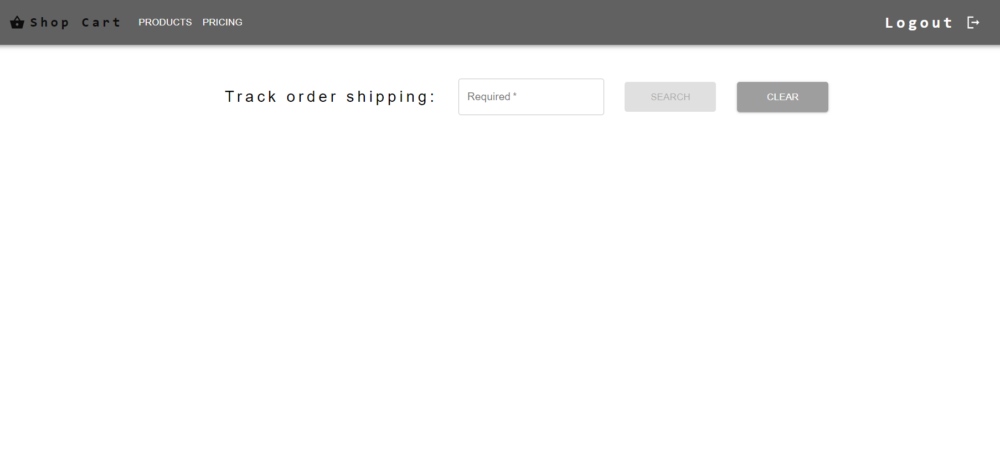
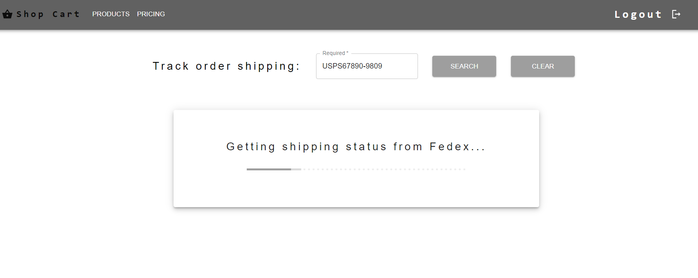
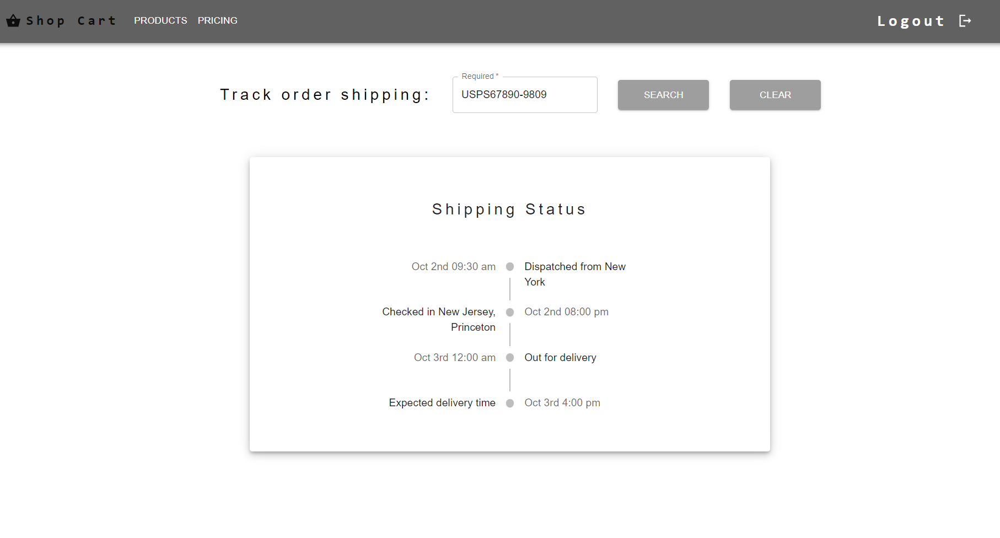

# API-Polling-With_react-polling

implementation to make API polling till the shipping details are retrieved from third part API's.gaming website.

- React
- Material UI
- React Polling
- Express
- Cors

Ref: Working application gif available within `./api-polling/resources/`

